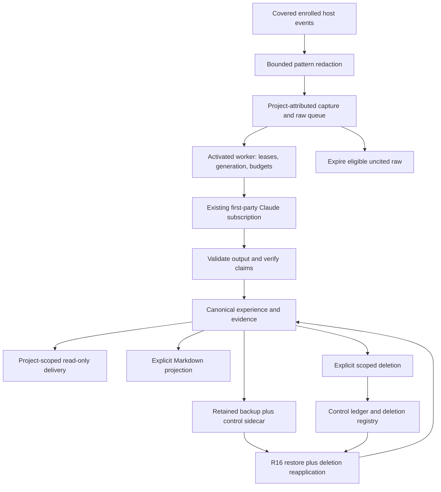

# Capture, experience and deletion

ShadowGraph stores experience for later use. It does not decide which work to do or control the host. Capture coverage and permission to read memory are separate: capturing an enrolled project's events never grants another project permission to read them.

## Data flow



The extraction route receives bounded redacted capture under the configured activation and budget controls. Pattern redaction does not guarantee removal of every possible secret. Host transcripts, retained backups, owner-controlled projections and endpoint-held copies have separate lifecycles; the location table below states the limits. No read or delivery operation completes a pending purge or restore.

## Retention and cited sources

Uncited raw capture has a configured retention window. Eligible raw expires even when associated with quarantined material. Expiry removes only eligible raw; it never releases quarantine or deletes accepted experience merely because the raw has expired. Evidence cited by surviving experience is retained until authorized deletion reaches it. Expired or deleted raw may no longer be available for re-extraction.

Authorized deletion can remove a source while leaving accepted experience that belongs to another scope. The surviving record keeps its canonical text and the verification class, verifier version, rule and span recorded while the source was checkable. Its source is marked unavailable. Controlled copies of that source's evidence and alternative readings are removed from canonical records, journal/baseline copies and retry values. T1 and expanded records report source unavailability; an unavailable source is not new verification and does not change the previously recorded claim class.

Producing-source identity and cited-source identity remain distinct. A record produced from A may cite B: deleting A does not remove B's evidence. Imported mixed-source causal readings sometimes have no per-reading source identity. Partial removal of such readings refuses before mutation rather than deleting another source's required evidence or claiming the selected source was erased. An operation selecting every cited source, or deleting the experience itself, can remove the complete copy. The error does not broaden the selected deletion scope.

Quarantine is reversible withholding. Read views hide copied evidence from held sources while privileged saves preserve the canonical original for an authorized owner release. Owner-only quarantine purge physically removes selected held material but retains its quarantine knowledge. A retained backup can therefore restore bytes that remain hidden; this is not a claim of complete physical erasure.

## Explicit scope and durable removal

`purgeProject(project, { mode })` selects the named project's material. `purgeOrigin(originId, { mode })` selects only material whose attribution is `unattributed` and whose exact origin matches. A project-owned item with the same provenance origin remains owned by its project and is not selected by origin purge. Ambiguous legacy material is not guessed into an origin.

The CLI accepts exactly one selector:

```sh
shadowgraph purge-preview '{"originId":"origin-to-remove"}'
shadowgraph purge '{"originId":"origin-to-remove","mode":"hard"}'
```

Logical purge retains identity-free journal skeletons; hard purge splices entries and records the resulting sequence gaps. Both use the existing staged store commit and content-free control-ledger/deletion-registry boundary. Pending removal is completed by a supported write, never by delivery, a read or a capture-hook update. Reads hide the pending scope. Source-copy removal follows the same boundary, including restore reapplication.

Restore uses the unchanged R16 primitive, then applies local deletion knowledge before activating the restored graph. It never increases authority relative to the destination. A backup with no applicable local deletion knowledge can reintroduce older data; possibly purged legacy material that cannot be identified exactly remains quarantined, hidden and owner-releasable. A purge does not erase backups, interrupted-restore recovery files, registry records or tombstones.

Some supported raw entries have no associated capture item, erasure token or creation witness. If applicable non-postdated deletion knowledge reaches such unbound raw, restore or merge refuses before installation: this format cannot safely distinguish or quarantine it. A fresh path does not bypass applicable registry knowledge. Exact pending owner purges still hide raw-only selections on reads and preserve their original bytes for the authorized recovery write. A matching recorded purge marker can establish that a backup postdates a tombstone; an optional raw timestamp cannot.

## Markdown projections

Ordinary Markdown push retains stale files. Explicit `markdown-sync` push with `prune: true` removes only unchanged tracked projections for the selected project that have no live canonical record. `dryRun: true` reports the eligible count without deleting files. Edited files, untracked files, other projects, unsafe paths and hard-linked files are preserved or reported as conflicts. A failure to write tracking after file deletion can be retried; it is reported as failure, not successful cleanup.

Pull refuses a tracked missing canonical record and an untracked identity still known to be held. It also refuses revival of known invalidated experience. Once both historical identity knowledge and tracking are absent, an independent file cannot always be recognized as a formerly deleted projection. Manual copies and owner-edited files remain outside automatic erasure claims.

## Data locations and limits

| Location | Controlled behavior and retained limits |
| --- | --- |
| Active canonical store | JSON/SQLite records, facts, journal, retry values, indexes and typed source-evidence copies follow the authorized deletion selection and restore knowledge. Recorded verification and surviving accepted text are governed by their own scope. |
| Store locks and ordinary save temporaries | Transient files use the existing fenced cleanup and refusal rules. Genuine interrupted-restore recovery files are retained, separately from ordinary save residue. |
| Raw capture and pending queue | Configured retention applies to eligible uncited raw. Cited evidence is protected from automatic expiry. Expiry never releases quarantine. |
| Extraction child workspace/request/response | Bounded redacted material uses the approved first-party subscription route. Child settlement and temporary cleanup have separate evidence; no alternate provider or paid fallback. |
| Host session transcripts | Host-controlled copies of hook input and delivered output are outside store purge. |
| Host asynchronous hook records | Host-controlled copies are outside store purge. |
| Host spill/preview files | Existence and lifecycle are host dependent; no claim that store deletion erases these copies. Delivery does not rely on content beyond the verified cap. |
| Backups, interrupted-restore recovery files, and the preservation and downgraded copies `migrate` and `downgrade` write | Retained. They can hold material later purged or expired from the active store. This remains an accepted documented local limitation, not a resolved erasure guarantee. |
| Markdown workspace projections | Explicit selected-project prune has the bounds above; owner edits and independent copies are retained. |
| Configured local embedding endpoint | Endpoint-held and in-flight copies are not represented as synchronously erased by store purge. No new provider is introduced. |
| Store control ledger and backup sidecar | Content-free deletion, quarantine, retention and generation knowledge; transient pending inputs have their established bounded lifecycle. Reads do not resolve pending work. |
| Per-user deletion registry | Content-free tombstones and lineage anchors; never included in exports/backups and never automatically pruned. Loss of this knowledge limits restore protection. |

## Compatibility and rollback

Preserving unknown members does not enforce their semantics. The standalone origin reader understands completed origin markers but does not perform origin-sensitive recovery. The subsequent source-evidence reader accepts completed unavailable ambiguous evidence without inventing placeholder readings and qualifies read output. That completed-output preservation floor does not cover pending raw-only project deletion: safe pending reads and complete origin/source-deletion recovery require the PR43 deletion writer or newer.

Do not connect an older recovery build or active extraction worker to these states. Disable extraction and prove child settlement before a supported rollback, preserve compatible activation/generation/budget records, and never open the store with a build below a required floor: give such a build only a `downgrade` copy, which leaves out what it cannot honour (see [Moving between 0.41.0 and `main`](../README.md#moving-between-0410-and-main)). A runtime downgrade must not restore older activation bytes, refund reservations or silently re-enable work. Capability floors apply in addition to the payload's schema version and the ledger's version.

These implementation and test claims do not assess the programme's acceptance criteria or establish release readiness.
